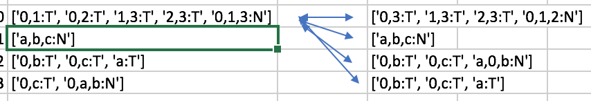

```{r setup, include=FALSE}
htmltools::tagList(rmarkdown::html_dependency_font_awesome())
```
# Experiments

<i class="fa fa-file"></i>

## Production Rules Overlap

Basic comparison of documents with production rules 

```
['ucidata-zachary', 'lexm'] vs mcs 	(0, 3)
['ucidata-zachary', 'lexm'] vs mcsm 	(5, 3)
['ucidata-zachary', 'lexm'] vs mind 	(0, 3)
['ucidata-zachary', 'mcs'] vs lexm 	(0, 3)
['ucidata-zachary', 'mcs'] vs mcsm 	(0, 3)
['ucidata-zachary', 'mcs'] vs mind 	(0, 3)
['ucidata-zachary', 'mcsm'] vs lexm 	(5, 3)
['ucidata-zachary', 'mcsm'] vs mcs 	(0, 3)
['ucidata-zachary', 'mcsm'] vs mind 	(0, 3)
['ucidata-zachary', 'mind'] vs lexm 	(0, 3)
['ucidata-zachary', 'mind'] vs mcs 	(0, 3)
['ucidata-zachary', 'mind'] vs mcsm 	(0, 3)
```
Using Isomorphic graph fragment test

```
['ucidata-zachary', 'lexm'] mcs 	0
['ucidata-zachary', 'lexm'] mcsm 	240
['ucidata-zachary', 'lexm'] mind 	0
['ucidata-zachary', 'mcs'] lexm 	0
['ucidata-zachary', 'mcs'] mcsm 	0
['ucidata-zachary', 'mcs'] mind 	40
['ucidata-zachary', 'mcsm'] lexm 	240
['ucidata-zachary', 'mcsm'] mcs 	0
['ucidata-zachary', 'mcsm'] mind 	0
['ucidata-zachary', 'mind'] lexm 	0
['ucidata-zachary', 'mind'] mcs 	40
['ucidata-zachary', 'mind'] mcsm 	0
```

### Toy Example
```
>>> df = pd.read_csv('BoardEx.lexm.prules.bz2', index_col=0, compression='bz2')
>>> df
      0      1                                                2     3
0  r0.0      S  ['0,1:T', '0,2:T', '1,3:T', '2,3:T', '0,1,3:N']  1.00
1  r1.0  a,b,c                                      ['a,b,c:N']  0.50
2  r1.1  a,b,c                        ['0,b:T', '0,c:T', 'a:T']  0.25
3  r1.2  a,b,c                             ['0,c:T', '0,a,b:N']  0.25

and 
>>> df = pd.read_csv('BoardEx.mcsm.prules.bz2', index_col=0, compression='bz2')
>>> df
      0      1                                       2     3
0  r0.0      S  ['0,3:T', '1,3:T', '2,3:T', '0,1,2:N']  1.00
1  r1.0  a,b,c                             ['a,b,c:N']  0.50
2  r1.1  a,b,c           ['0,b:T', '0,c:T', 'a,0,b:N']  0.25
3  r1.2  a,b,c               ['0,b:T', '0,c:T', 'a:T']  0.25
```

This figure shows how the algorithm takes every combiation of two rules to test 
if the the pair are `is_isomorphic`.


And here is the overlap (showing one set of pair wise comparisons):
```
Standard Overlap
['BoardEx', 'lexm'] vs mcs 	(1, 3)
['BoardEx', 'lexm'] vs mcsm 	(2, 3)
['BoardEx', 'lexm'] vs mind 	(1, 3)
['BoardEx', 'lexm'] vs minf 	(2, 3)

Isomorphic Graph Fragments
['BoardEx', 'lexm'] mcs 	2
['BoardEx', 'lexm'] mcsm 	3
['BoardEx', 'lexm'] mind 	2
['BoardEx', 'lexm'] minf 	3
```


